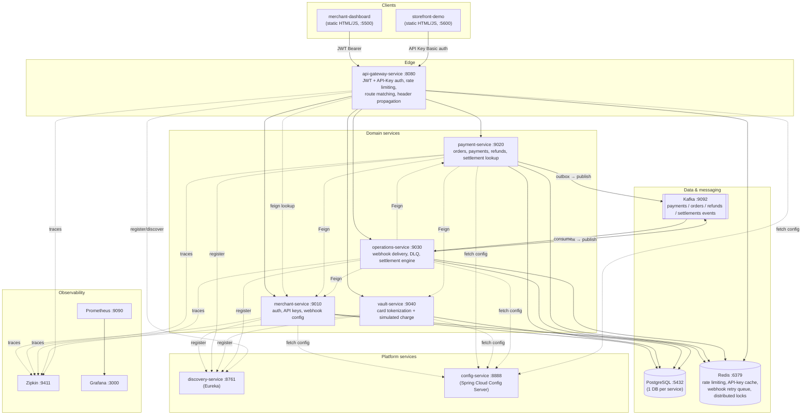
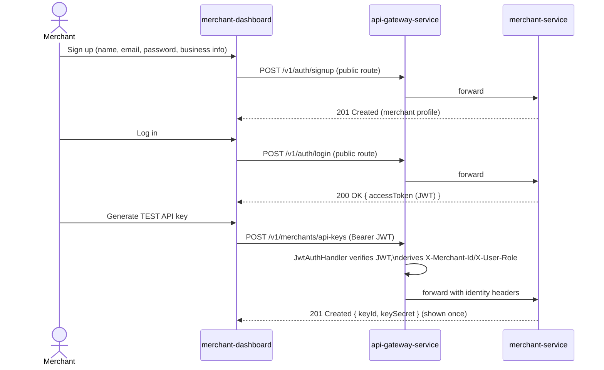
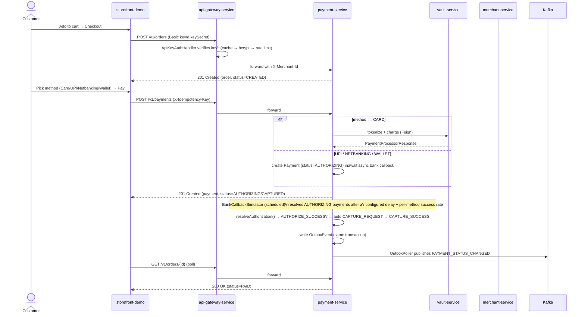
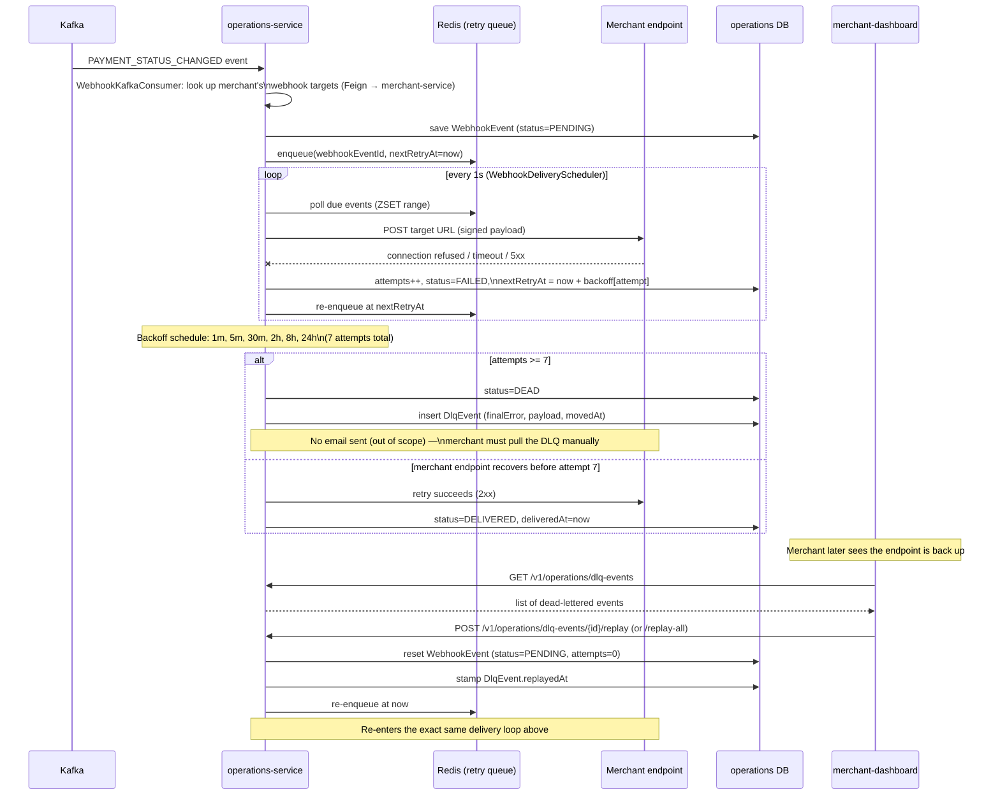
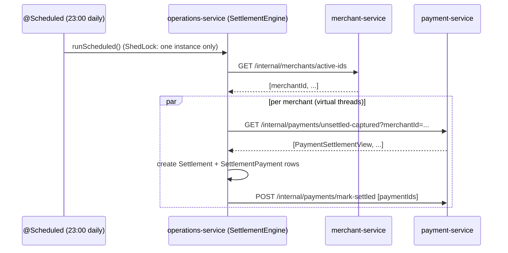

# ZestPay — Distributed Payments Platform

**ZestPay** is a production-style, event-driven microservices payments platform inspired by
Razorpay: merchant onboarding, orders,
payments (card/UPI/netbanking/wallet), card tokenization, async bank settlement, webhook delivery
with retries + dead-letter replay, and nightly merchant settlement — built with Spring Boot,
Spring Cloud (Config, Eureka, Gateway), Kafka, Redis, PostgreSQL, and full observability
(Zipkin, Prometheus, Grafana).

Two plain HTML/JS front-ends are included so the whole system can be demoed end-to-end without
any frontend build tooling:
- **`merchant-dashboard`** — the merchant's back office (signup/login, API keys, webhooks, orders).
- **`storefront-demo`** — a mock e-commerce checkout that integrates the gateway like a real merchant would.

---

## Table of contents

- [Tech stack](#tech-stack)
- [Architecture](#architecture)
- [Services at a glance](#services-at-a-glance)
- [Key design patterns](#key-design-patterns)
- [Domain flows (sequence diagrams)](#domain-flows-sequence-diagrams)
- [Repository layout](#repository-layout)
- [Prerequisites](#prerequisites)
- [Running it locally](#running-it-locally)
- [Demo walkthrough](#demo-walkthrough)
- [Running on Kubernetes (kind)](#running-on-kubernetes-kind)
- [Observability](#observability)
- [Configuration reference](#configuration-reference)
- [Tests](#tests)
- [Troubleshooting](#troubleshooting)

---

## Tech stack

| Layer | Technology |
|---|---|
| **Language / runtime** | Java 25, Maven (per-service `mvnw` wrapper) |
| **Application framework** | Spring Boot 4.1 |
| **Microservices platform** | Spring Cloud 2025.1.2 — Config Server, Netflix Eureka (service discovery), Spring Cloud Gateway (WebMVC), OpenFeign (declarative HTTP clients) |
| **Persistence** | PostgreSQL 16, Spring Data JPA / Hibernate (one database per service) |
| **Caching / in-memory data** | Redis 7 — API-key cache, rate limiting, webhook retry queue (sorted set), ShedLock distributed locks, secret-verification cache |
| **Messaging** | Apache Kafka (KRaft mode) — domain events (`payments`, `orders`, `refunds`, `settlements`), transactional outbox pattern |
| **Resilience** | Resilience4j (circuit breaker + retry on Feign calls), ShedLock (`shedlock-spring` + `shedlock-provider-redis-spring` for singleton `@Scheduled` jobs) |
| **Security** | JWT (`jjwt`) for merchant sessions, HTTP Basic API keys (BCrypt-hashed secrets) for server-to-server calls, Spring Security Crypto |
| **Object mapping / boilerplate** | MapStruct 1.6, Lombok |
| **Observability** | Micrometer, Zipkin (distributed tracing), Prometheus (metrics scraping), Grafana (dashboards) |
| **Containerization** | Docker, Google Jib (`jib-maven-plugin` — builds container images without a Dockerfile), Docker Compose (local infra + observability stacks) |
| **Orchestration** | Kubernetes (via `kind` for local clusters), Kustomize |
| **Load testing** | Apache JMeter (`k8s/Razorpay Load Testing.jmx`) |
| **Frontends** | Plain HTML5 / CSS3 / vanilla JavaScript (no framework, no build step) — `merchant-dashboard` and `storefront-demo`, served via Python's `http.server` |
| **Build tooling** | Maven multi-module-style layout (each service is an independent Maven project depending on the shared `common-lib` artifact) |

---

## Architecture



**Request path:** every external call goes through the gateway, which (a) authenticates via
either a merchant's JWT (dashboard session) or an API key (server-to-server, e.g. a storefront
backend), (b) rate-limits API-key traffic, (c) strips/re-derives identity headers
(`X-Merchant-Id`, `X-User-Role` / `X-Environment`, `X-Key-Id`) so downstream services never trust
client-supplied headers directly, and (d) routes by path prefix to the owning service (see
[Configuration reference](#configuration-reference) for the exact route table). Internal
service-to-service calls (`/internal/**`) go **directly** via Eureka + Feign, bypassing the gateway.

---

## Services at a glance

| Service | Port | Responsibility | Own DB | Talks to |
|---|---|---|---|---|
| `discovery-service` | 8761 | Eureka service registry | — | — |
| `config-service` | 8888 | Centralized config, backed by a Git repo (`distributed-razrorpay-config`) | — | — |
| `api-gateway-service` | 8080 | Single entry point: JWT/API-key auth, rate limiting, routing | — | Redis, all domain services, Eureka |
| `merchant-service` | 9010 | Merchant signup/login (JWT), API key issuance/rotation/revocation, webhook config (CRUD), internal lookups | `razorpay-merchant-db` | Redis, Kafka (consumer group), Postgres |
| `payment-service` | 9020 | Orders, payment initiation/capture/refund, transactional outbox → Kafka, bank-authorization simulator, settlement lookup API | `razorpay-payment-db` | merchant-service (Feign), vault-service (Feign), Redis, Kafka, Postgres |
| `vault-service` | 9040 | Card tokenization (never stores raw PAN beyond the charge call), simulated card processor charge | `razorpay-vault-db` | Postgres |
| `operations-service` | 9030 | Consumes domain events → creates webhook deliveries, retry/backoff scheduler, dead-letter queue + manual replay, nightly settlement engine | `razorpay-operations-db` | merchant-service (Feign), payment-service (Feign), Redis, Kafka, Postgres |
| `merchant-dashboard` | 5500 (static) | Merchant back-office UI | — | Gateway (JWT) |
| `storefront-demo` | 5600 (static) | Mock storefront / checkout integration | — | Gateway (API key) |

Plus `common-lib`: a shared Maven module (installed to the local repo, **not** a runnable
service) with the JPA `BaseEntity`, shared enums/DTOs/exceptions, `MerchantContext`,
`MerchantContextFilter`, rate limiter, API-key cache, idempotency filter, and the global
exception handler used by every domain service.

---

## Key design patterns

- **Dual authentication at the edge** — JWT bearer tokens for interactive dashboard sessions,
  HTTP Basic (`keyId:keySecret`) API keys for server-to-server integrations — both normalized into
  the same `X-Merchant-Id` header before reaching domain services (`GatewayAuthFilter`,
  `JwtAuthHandler`, `ApiKeyAuthHandler`).
- **Fail-safe API-key verification** — API-key lookups are cached (Redis + in-memory
  `ApiKeyCache`), bcrypt-verified, and support a "grace period" previous-secret so key rotation
  doesn't break in-flight clients. A downstream outage during lookup returns `503` (not `401`) so
  legitimate merchants aren't told their credentials are wrong.
- **Per-key rate limiting** — fixed-window limiter backed by Redis, with `X-RateLimit-*` /
  `Retry-After` response headers.
- **Idempotent payment initiation** — `X-Idempotency-Key` header + `paymentAuthorizationRecorder`
  replay-detection so a retried "pay now" click can't double-charge.
- **Transactional outbox** — `payment-service` and `operations-service` write domain events to an
  `outbox_event` table in the *same transaction* as the business change, then a `@Scheduled`
  `OutboxPoller` (guarded by ShedLock so only one instance publishes) publishes to Kafka —
  guaranteeing at-least-once delivery without dual-write bugs.
- **Explicit payment state machine** — `PaymentTransitionService` enforces valid
  `PaymentStatus` transitions (`CREATED → AUTHORIZING → AUTHORIZED → CAPTURING → CAPTURED → ...`);
  invalid transitions raise `InvalidStateTransitionException`.
- **Simulated async bank + settlement** — `BankCallbackSimulator` and
  `PaymentAuthorizationExpiryJob` resolve `AUTHORIZING` payments on a delay (configurable success
  rate / chaos mode per method) instead of a real bank; `SettlementEngine` runs nightly (cron) and
  fans out per-merchant settlement via virtual threads.
- **Resilience on inter-service calls** — Feign clients wrapped with Resilience4j circuit
  breakers + retries (`payment-service → merchant-service/vault-service`,
  `operations-service → merchant-service/payment-service`), tuned per dependency in config.
- **Webhook delivery with exponential backoff + DLQ + manual redrive** — see the
  [dedicated flow below](#3-webhook-delivery-merchant-endpoint-down--dead-letter-queue--replay);
  this is the "what happens if the merchant's server is down" story end-to-end.
- **Distributed scheduling locks** — every `@Scheduled` job that must run on exactly one instance
  (outbox pollers, webhook delivery poller/reconciler, settlement engine, bank simulators) is
  guarded with `@SchedulerLock` (ShedLock, Redis-backed) so horizontally scaling a service doesn't
  cause duplicate processing.
- **Centralized config + service discovery** — every service imports config at boot from
  `config-service` (itself backed by a Git repo, hot-reloadable) and registers with Eureka; the
  gateway resolves `lb://<service>` via Eureka instead of hardcoded hosts.
- **Full request tracing + metrics** — Micrometer + Zipkin tracing and Prometheus metrics wired
  into every service via `common-lib`.

---

## Domain flows (sequence diagrams)

### 1. Merchant onboarding + API key issuance



### 2. Checkout → order → payment → capture (happy path)



### 3. Webhook delivery, merchant endpoint down → dead-letter queue → replay

This is the core "what happens if the merchant's server is down when we try to notify them"
story, and how it's recovered **without email** — the merchant manually pulls the backlog from
the dashboard once their endpoint is back up.



### 4. Nightly settlement



---

## Repository layout

```
razorpay-project/
├── common-lib/              # shared JPA base entity, enums, DTOs, exceptions, filters, rate limiter (Maven dependency, not a service)
├── discovery-service/       # Eureka server
├── config-service/          # Spring Cloud Config server (Git-backed)
├── api-gateway-service/     # Edge: auth, rate limiting, routing
├── merchant-service/        # Auth, API keys, webhook config
├── payment-service/         # Orders, payments, refunds, outbox, bank/settlement simulation
├── vault-service/           # Card tokenization + simulated processor
├── operations-service/      # Webhook delivery + DLQ, settlement engine
├── merchant-dashboard/      # Static HTML/JS merchant back-office UI
├── storefront-demo/         # Static HTML/JS mock storefront/checkout
├── infra/
│   ├── docker-compose.yml   # Postgres, Redis, Kafka for local dev
│   └── postgres-init/init.sh# creates per-service databases
├── observability/
│   ├── docker-compose.yml   # Zipkin, Prometheus, Grafana
│   └── provisioning/        # Grafana datasource/dashboard provisioning
└── k8s/                     # kind cluster config + kustomize manifests for all services
```

---

## Prerequisites

- **Java 25** and **Maven** (each service ships its own `mvnw` wrapper)
- **Docker** + **Docker Compose** (for Postgres, Redis, Kafka, and the observability stack)
- **Python 3** (only to serve the two static frontends via `python3 -m http.server`) — no
  Node/build step required
- A **GitHub personal access token or password** if you want `config-service` to pull from your
  own fork of the config repo (`distributed-razrorpay-config`) — see
  [Configuration reference](#configuration-reference)

---

## Running it locally

All commands are run from the project root unless stated otherwise.

### 1. Start infrastructure (Postgres, Redis, Kafka)

```bash
cd infra
docker compose up -d
cd ..
```

This provisions:
- Postgres on `5432` with 4 databases pre-created (`razorpay-merchant-db`, `razorpay-payment-db`,
  `razorpay-operations-db`, `razorpay-vault-db`), owned by a superuser `anuj` / `password`
  (see `infra/postgres-init/init.sh`).
- Redis on `6379`.
- A single-node Kafka (KRaft mode) on `9092` (internal) / `29092` (host).

> ⚠️ The config-server's default datasource `username`/`password` are intentionally blank (they're
> meant to be supplied per-environment). For local runs, export these before starting each domain
> service so Spring picks them up:
> ```bash
> export SPRING_DATASOURCE_USERNAME=anuj
> export SPRING_DATASOURCE_PASSWORD=password
> ```

### 2. (Optional) Start observability stack

```bash
cd observability
docker compose up -d
cd ..
```
Zipkin → http://localhost:9411, Prometheus → http://localhost:9090, Grafana → http://localhost:3000 (`admin`/`admin`).

### 3. Build & install the shared library

Every service depends on `common-lib` via Maven coordinates, so install it locally first:

```bash
cd common-lib && ./mvnw -q -DskipTests install && cd ..
```

### 4. Start the platform services, in this exact order

Each service is a normal Spring Boot app (`./mvnw spring-boot:run` or the packaged jar). Start
them **in order** since each later service depends on the ones before it being registered/config
being available.

```bash
# 1) Service registry
cd discovery-service && ./mvnw spring-boot:run &

# 2) Config server (needs your config repo credentials if you forked it)
cd config-service && ./mvnw spring-boot:run &

# 3) Domain services (can start in parallel once config-service + discovery-service are up)
cd merchant-service   && SPRING_DATASOURCE_USERNAME=anuj SPRING_DATASOURCE_PASSWORD=password ./mvnw spring-boot:run &
cd payment-service    && SPRING_DATASOURCE_USERNAME=anuj SPRING_DATASOURCE_PASSWORD=password ./mvnw spring-boot:run &
cd vault-service      && SPRING_DATASOURCE_USERNAME=anuj SPRING_DATASOURCE_PASSWORD=password ./mvnw spring-boot:run &
cd operations-service && SPRING_DATASOURCE_USERNAME=anuj SPRING_DATASOURCE_PASSWORD=password ./mvnw spring-boot:run &

# 4) Gateway (last — it discovers the others via Eureka)
cd api-gateway-service && ./mvnw spring-boot:run &
```

Health-check each service as it comes up:

```bash
curl http://localhost:8761               # Eureka dashboard (HTML)
curl http://localhost:8888/actuator/health
curl http://localhost:9010/actuator/health   # merchant-service
curl http://localhost:9020/actuator/health   # payment-service
curl http://localhost:9040/actuator/health   # vault-service
curl http://localhost:9030/actuator/health   # operations-service
curl http://localhost:8080/actuator/health   # api-gateway-service
```

All five domain-side services should also show up as `UP` instances on the Eureka dashboard
(http://localhost:8761) before you rely on gateway routing.

### 5. Serve the two frontends

```bash
cd merchant-dashboard && python3 -m http.server 5500 &   # http://localhost:5500
cd storefront-demo    && python3 -m http.server 5600 &    # http://localhost:5600
```

Both apps have a "Gateway URL" field defaulting to `http://localhost:8080` — change it if your
gateway runs elsewhere.

---

## Demo walkthrough

1. **Onboard a merchant** — open the dashboard (`:5500`) → sign up → log in.
2. **Generate a TEST API key** — *API Keys* tab → *Generate new key* → copy the Key ID + Secret
   (shown once).
3. **Wire up the storefront** — open the storefront (`:5600`) → ⚙ *Payments* → paste the gateway
   URL + Key ID + Secret.
4. **See the happy path** — add products to cart → checkout → pay with any Luhn-valid card
   (e.g. `4111 1111 1111 1111`) → watch the order become `PAID` in both the storefront and the
   dashboard's *Orders* tab.
5. **Simulate "merchant server is down"**:
   - Dashboard → *Webhooks* → add a webhook with `targetUrl` pointing at something unreachable
     (e.g. `http://localhost:9999/whatever`).
   - Make another payment on the storefront.
   - Watch *Webhooks → Delivery history* (auto-refreshes every 5s): the row goes
     `PENDING → FAILED (retrying)`, `attempts` climbing, `nextRetryAt` following the backoff
     schedule (1m, 5m, 30m, 2h, 8h, 24h). After 7 attempts it becomes `DEAD`.
6. **Recover from the dead-letter queue**:
   - Once you'd fix your real endpoint, go to *Webhooks → Dead-lettered events (DLQ)*.
   - Click **Replay** on the event (or **Replay all**) — it re-enters the same delivery pipeline
     and, assuming the endpoint is now reachable, flips to `DELIVERED` on the next poll.
   - (For a quick local "working" target, point a webhook at
     `POST {gateway}/webhook/success`, a built-in dummy endpoint that always returns `204`.)

---

## Running on Kubernetes (kind)

`k8s/` contains a full `kustomize` bundle: namespace, a shared `ConfigMap`/`Secret`, stateful sets
for Postgres/Redis/Kafka/Zipkin/Prometheus/Grafana, and a `Deployment`+`Service` per app service.

```bash
kind create cluster --config k8s/kind-config.yaml
kubectl apply -k k8s/
kubectl -n razorpay-core get pods -w
```

Populate `k8s/k8s-secrets.env` (git-ignored — do **not** commit real secrets) with at least:
`JWT_SECRET`, `WEBHOOK_SECRET_ENCRYPTION_KEY`, `VAULT_MASTER_KEY`, `GIT_CONFIG_REPO`,
`GIT_USERNAME`, `GIT_PASSWORD`, and each service's `*_DB_PASSWORD` — these map 1:1 to the `k8s`
Spring profile blocks in the config repo. `k8s/api_keys.csv` and `k8s/Razorpay Load Testing.jmx`
support a JMeter load test against the cluster.

---

## Observability

- **Tracing** — every service ships spans to Zipkin (http://localhost:9411); trace a request
  across gateway → domain service → downstream Feign calls.
- **Metrics** — Prometheus (http://localhost:9090) scrapes each service's `/actuator/prometheus`
  endpoint; Grafana (http://localhost:3000) is pre-provisioned with a Prometheus datasource.
- **Logs** — each service logs to stdout; `logs/` at the repo root is a scratch directory for
  local file-based logs if you redirect them there.

---

## Configuration reference

All runtime configuration lives in an external Git repo consumed by `config-service`
(`spring.cloud.config.server.git.uri` in `config-service/src/main/resources/application.yaml`),
with one file per service (`api-gateway-service.yml`, `merchant-service.yml`, `payment-service.yml`,
`vault-service.yml`, `operations-service.yml`) plus a shared `application.yml`.

**Gateway route table** (`api-gateway-service.yml`) — the single source of truth for which path
prefixes reach which service:

| Path prefix | Routed to | Auth |
|---|---|---|
| `/v1/auth/**` | merchant-service | public |
| `/v1/merchants/**` | merchant-service | protected (JWT or API key) — dashboard uses JWT |
| `/v1/orders/**`, `/v1/payments/**` | payment-service | protected (JWT or API key) — storefront uses API key |
| `/v1/vault/**` | vault-service | protected (JWT or API key) |
| `/webhook/**` | operations-service | public (dummy merchant endpoint for demos) |
| `/v1/operations/**` | operations-service | protected (JWT or API key) — dashboard uses JWT |
| `/actuator/**` | gateway itself | public |

> If you add a new merchant-facing endpoint under `/v1/operations/**` (or any new prefix) on
> `operations-service`, remember the gateway **route predicate** must also be updated — adding a
> path to `app.security.public-routes` only affects the auth allow-list, not routing; a path with
> no matching route predicate falls through to Spring's static-resource handler and surfaces as
> `NoResourceFoundException`, even though the controller itself is correct.

**Key environment variables** (mostly relevant for the `k8s` profile):

| Variable | Used by | Purpose |
|---|---|---|
| `CONFIG_SERVER_URL` | all services | Override config-server location (default `http://localhost:8888`) |
| `SPRING_DATASOURCE_USERNAME` / `_PASSWORD` | merchant/payment/vault/operations-service | Postgres credentials (blank by default — see [Running it locally](#running-it-locally)) |
| `JWT_SECRET` | merchant-service, api-gateway-service | Shared HMAC secret for signing/verifying merchant JWTs |
| `WEBHOOK_SECRET_ENCRYPTION_KEY` | merchant-service | Encrypts stored webhook secrets at rest |
| `VAULT_MASTER_KEY` | vault-service | Encrypts tokenized card data at rest |
| `GIT_CONFIG_REPO` / `GIT_USERNAME` / `GIT_PASSWORD` | config-service (k8s profile) | Points config-server at your Git-backed config repo |
| `MERCHANT_SERVICE_URI` / `PAYMENT_SERVICE_URI` / `VAULT_SERVICE_URI` / `OPERATIONS_SERVICE_URI` | api-gateway-service (k8s profile) | Override `lb://` discovery with fixed in-cluster DNS names |

---

## Tests

Each service has its own test suite (JUnit 5 + Spring Boot Test):

```bash
cd common-lib && ./mvnw test && cd ..
cd merchant-service && ./mvnw test && cd ..
cd payment-service && ./mvnw test && cd ..
cd vault-service && ./mvnw test && cd ..
cd operations-service && ./mvnw test && cd ..
cd api-gateway-service && ./mvnw test && cd ..
```

---

## Troubleshooting

- **`NoResourceFoundException` for a `/v1/...` path** — the gateway has no route predicate
  matching that path (see the note in [Configuration reference](#configuration-reference)); check
  `api-gateway-service.yml`'s `spring.cloud.gateway.server.webmvc.routes`.
- **A domain service won't start / can't reach Postgres** — confirm `SPRING_DATASOURCE_USERNAME`
  /`_PASSWORD` are exported (defaults are blank), and that `infra/docker-compose.yml`'s Postgres
  container is healthy (`docker compose ps`).
- **Webhook deliveries never leave `PENDING`** — check `operations-service` logs for Redis
  connectivity (the retry queue lives in Redis) and confirm `WebhookDeliveryScheduler` is running
  (it logs on each poll cycle when there's due work).
- **Feign calls between services fail with `UNKNOWN`/connection errors** — confirm the target
  service is registered and `UP` in Eureka (http://localhost:8761) before the caller started, or
  restart the caller after the callee registers.
